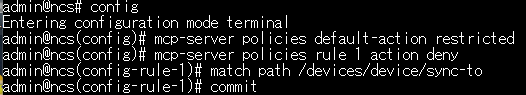
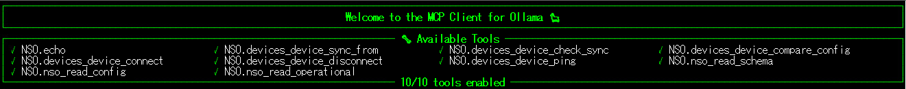
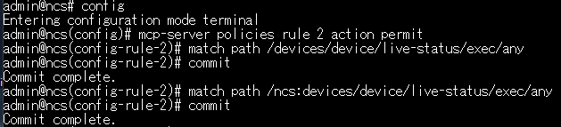
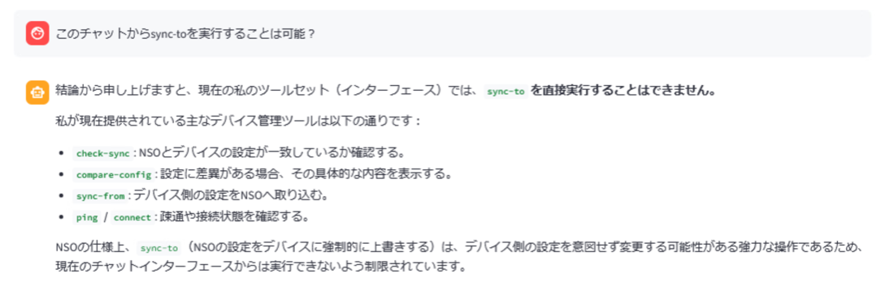
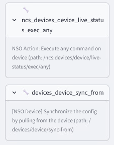
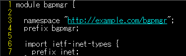
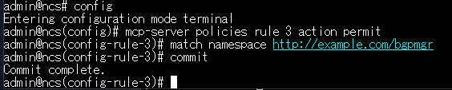
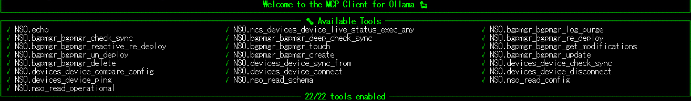
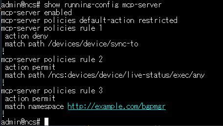

# NSO MCP Policy

In this lab scenario you will learn how to use the NSO MCP server policy
to apply settings closer to a production environment.
You will also learn how to publish loaded packages.

## Learning Objectives

After completing this lab, you will be able to:

- Understand the basics of writing an NSO MCP policy
- Learn how to publish loaded service packages
- Understand that there are two policy matching methods: `path` and `namespace`

## Prerequisites

- [ ] [NSO MCP Setup](10-nso-mcp-setup.md) must be completed.
- [ ] The Web MCP client must be reachable at <http://localhost:8501/>.
- [ ] The **bgpmgr** package must already be loaded.

## NSO MCP Policy

The NSO MCP policy `default-action` has three pre-defined values.
Configure each one and check how many Tools are exposed in ollmcp.

| default-action | Description                        | Number of Tools in ollmcp |
|----------------|------------------------------------|---------------------------|
| deny           | Deny all requests                  | 0                         |
| permit         | Allow all requests                 | 206                       |
| restricted     | Allow NSO core operations only     | 11                        |

The following is an example with `restricted` set — 11 Tools are exposed.

## Path-Based Policy 1: Denying sync-to

First, set the MCP policy to `restricted` to limit it to the 11 pre-defined tools.
Then use an individual policy rule to restrict **sync-to**, narrowing the set down to 10 Tools.
Configure NSO as follows:

    config
    mcp-server policies default-action restricted
    mcp-server policies rule 1 action deny
      match path /devices/device/sync-to
      commit

If ollmcp is running, stop it with ++ctrl+c++ and restart it.
Check the number of Tools in ollmcp — you will see that **sync-to** has been removed, leaving 10 Tools.

## Path-Based Policy 2: Permitting live-status

With the current configuration, implement a `permit` rule next.
Under **restricted**, **live-status** is unavailable, so `show` commands cannot be executed.
Enable `show` commands with the following configuration.

Configure NSO as follows:

    config
    mcp-server policies rule 2 action permit
      match path /ncs:devices/device/live-status/exec/any
      commit

Check the number of Tools in ollmcp — you will see that **live-status** has been added, bringing the count back to 11.

# Verification

Confirm that **sync-to** cannot be executed and that **show** commands can be run.
Press the **Refresh Tools** button in the WebUI to update the tool list, then test as follows:

!!! info "The Cisco AI API times out after a few minutes. If you receive a 500 error, restart both the frontend and backend."

> *"Is it possible to execute sync-to from this chat?"*

> *"Run show version on xr-2"*

## How to Find Paths

The `path` values used in policies are determined from the data model.
You can also identify them by looking at the Tools published by the NSO MCP server
via an MCP client such as ollmcp.
NSO includes path information within the published Tools.

Feel free to try denying and permitting various Tools.

## Package Policy
Both `path` and `namespace` can be used to specify policies.
So far we have used `path`; here we will use `namespace` to publish the bgpmgr package.

The namespace is defined at the top of the package's YANG file.
For bgpmgr it looks like this:

Use this to publish the policy.

Configure NSO as follows:

    config
    mcp-server policies rule 3 action permit
      match namespace http://example.com/bgpmgr
      commit

Check the number of Tools in ollmcp — you will see that 11 **bgpmgr** Tools have been added, bringing the total to 22.

As shown, using `namespace` lets you publish all Tools of a package in a single line.
The full configuration up to this point looks like this:

## Checklist

After completing the steps above, the following should be in place:

- [ ] `default-action` is set to **restricted**
- [ ] **sync-to** is disabled
- [ ] **live-status/any** is enabled
- [ ] All Tools of **bgpmgr** are enabled

## Troubleshooting

- **WebUI returns a 500 error** — The API has timed out. Stop both the backend and frontend, then restart them.
- **Policy changes are not applied** — The `path` or `namespace` value may be incorrect. Please verify the configuration carefully.

## Well Done!
You have completed the basics of the NSO MCP server.
If you have time to spare, try the optional [Create a custom Action Tool](13-add-an-action-tool.md) challenge.
