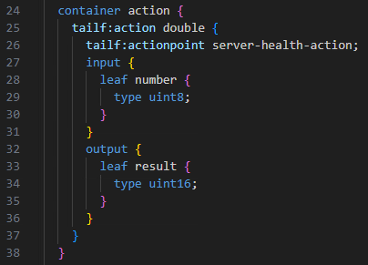
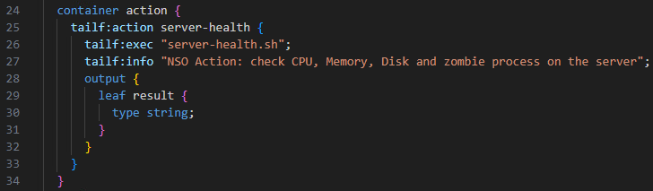
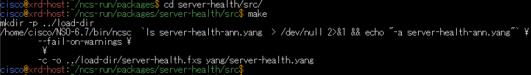
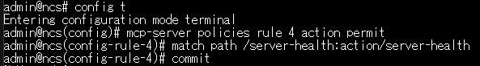
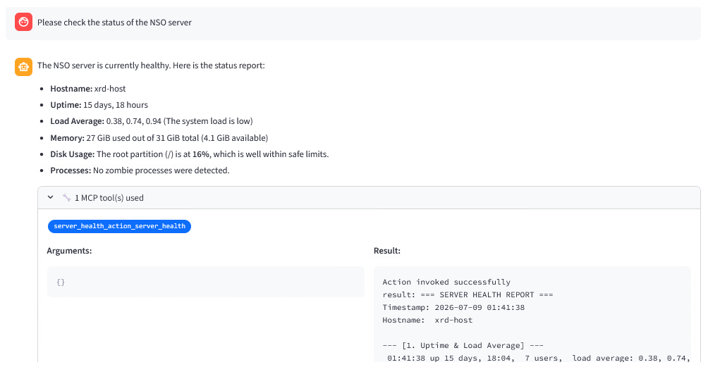

# Create a custom Action Tool

!!! info "This scenario is optional. Please give it a try if you have time."

## Learning Objectives

After completing this lab, you will be able to:

- Define a custom Action and use it as an MCP Tool
- Edit an Action script and query the NSO server's status using natural language

## Prerequisites

- [ ] Understanding of how to create NSO packages
- [ ] Understanding of NSO Actions (command execution rather than configuration management)
- [ ] Understanding of NSO MCP policies


## Defining a Custom Action

NSO is an orchestrator that manages device configurations.
However, it can also execute commands such as `show` in addition to configuration management.
In NSO, this type of command execution is called an **Action**.

For those who want to learn more about **Actions**, please refer to the webinar and past hands-on sessions conducted by our Customer Success team:

- [NSO Docs - Actions](https://nso-docs.cisco.com/guides/development/core-concepts/actions)


## Creating a Custom Action Package

Run the following commands on Linux to create a custom package:

    cd 
    cd ncs-run/packages
    ncs-make-package --service-skeleton python --action-example server-health

Next, edit the package's YANG file to execute an external script.
Open VSCode — if you see "Authentication required," just click "Cancel." You may need to repeat it a few times.

Edit `server-health.yang` located in `ncs-run/packages/server-health/src/yang`.



Make the following changes:
- Line 25: Rename the Action from `double` to `server-health`
- Line 26: Change **tailf:actionpoint** to **tailf:exec** and specify the script name `server-health.sh`
- Lines 27–31: Delete the `input` section (not needed)
- Line 34: Change the `output` type to `string`
- After line 26 (`tailf:exec`): Add `tailf:info` on the next line and write the description to use as the MCP Tool description



Then run `make` on Linux:

    cd server-health/src
    make



Log in to NSO and reload the packages:

    ncs_cli -Cu admin
    packages reload


## Placing the Execution Script

In VSCode, create and save a script named `server-health.sh` in `NSO-6.7/bin` with the following contents:

```bash
#!/usr/bin/bash

# Collect all output into a variable and print it all at once at the end
REPORT=$(cat << EOF
=== SERVER HEALTH REPORT ===
Timestamp: $(date '+%Y-%m-%d %H:%M:%S')
Hostname:  $(hostname)

--- [1. Uptime & Load Average] ---
$(uptime)

--- [2. Memory Usage] ---
$(free -h | awk '
  NR==1 {print "Type       Total      Used       Free       Shared     Buff/Cache Available"}
  NR==2 {printf "Mem:       %-10s %-10s %-10s %-10s %-10s %-10s\n", $2, $3, $4, $5, $6, $7}
  NR==3 {printf "Swap:      %-10s %-10s %-10s\n", $2, $3, $4}
')

--- [3. Disk Usage Status] ---
$(df -h | grep -E '^/dev/' | while read -r line; do
    usage=$(echo "$line" | awk '{print $5}' | sed 's/%//')
    mount=$(echo "$line" | awk '{print $6}')
    if [ "$usage" -ge 90 ]; then
        echo "[CRITICAL] $mount is at ${usage}%! Details: $line"
    elif [ "$usage" -ge 80 ]; then
        echo "[WARNING] $mount is at ${usage}%. Details: $line"
    else
        echo "[OK] $mount is at ${usage}%."
    fi
done)

--- [4. Zombie Processes] ---
$(zombies=$(ps aux | awk '{if ($8 == "Z") print $0}' | wc -l)
if [ "$zombies" -gt 0 ]; then
    echo "[WARNING] $zombies zombie process(es) detected."
else
    echo "[OK] No zombie processes."
fi)
=== END OF REPORT ===
EOF
)

# Output in a format that can be piped as a single string (result) for MCP Tool text output
echo result '"'"$REPORT"'"'
```

Then make the script executable on Linux:

    cd
    cd NSO-6.7/bin
    chmod +x server-health.sh

Run the script and confirm that server information is printed:

    


## Verifying via MCP

First, run `action server-health` in NSO to confirm the script can be called from NSO.


Next, publish this package as an MCP Tool.
Configure the following in NSO:

    config
    mcp-server policies rule 4 action permit
     match path /server-health:action/server-health




Click **Refresh Tools** in the WebUI and confirm that `server-health` is now available.


Ask the following question to verify that the server status can be checked via MCP:

> **Please check the status of the NSO server.**





!!! info "The server-health package can also be cloned from the repository below."
    [https://github.com/hitakaha/nso-server-health](https://github.com/hitakaha/nso-server-health)


## Checklist

After completing the steps above, the following should be in place:

- [ ] The **server-health** package is loaded successfully
- [ ] The NSO server status can be checked via the WebUI

## Troubleshooting

- **WebUI returns a 500 error** — The API has timed out. Stop both the frontend and backend with ++ctrl+c++ and restart them.

## Next Steps

This concludes the NSO MCP Hands-on Lab. Great work!
